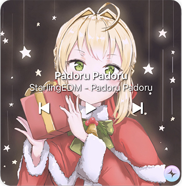
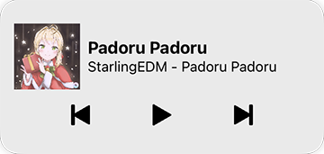

# Spotify4BigSur

Implements a Widget for Spotify in the Notification Center of macOS 11.0 BigSur.

Fork of [Spotify4Me by Carabineiro](https://github.com/carabina/Spotify4Me) reworked with WidgetKit to be compatible with macOS 10.11 Notification Center.

It uses the AppleScript API for Spotify to get the necessary information and control it.

Download [the latest release](https://github.com/fabiusBile/Spotify4BigSur/releases/latest), copy the "SpotifyMain.app" to your Applications folder and start it. Then go to the Notification Center and add the widget.

If you have already installed one version restart the Mac, replace the old SpofityMain.app with the new one and start it.
